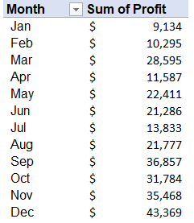
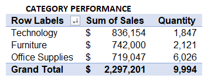

# US-SUPERSTORE
## Introduction
The report centers around a US Superstore, offering a comprehensive review of its sales performance over a four-year period **(2015-2018)**. Identifying the key drivers of growth and potential factors contributing to losses is essential for the store's continuous sales improvement and steady progress. Sales reporting plays a pivotal role in extracting valuable insights and assessing the efficacy of the strategies implemented in the store's operations. This dataset was chosen to analyze and gain insights into the various factors that impact the Superstore's ongoing success.

## Problem statement
The project intends to answer pertinent business questions that will share more light on the areas that US Superstore management will be interested in 
1. # Profitability Performance Analysis:
    To perform a profitability performance analysis, it is essential to examine various financial metrics, such as revenue, expenses, gross profit, net profit, profit margins, return on investment (ROI), and other relevant indicators. By analyzing these metrics, you can gain insights into the financial health and effectiveness of the business's operations and strategies. This analysis helps in identifying areas of strength and weakness, making informed decisions, and implementing improvements to enhance overall profitability. I focused on the following:

A. # Sales Performance Analysis
   		Sales trends across various months

B. # Top and Bottom 10 sales-generating states

C. # Profit trends across various months by states

D. # Regional Analysis Review
  	 • Sales Performance by region 
   	 • Profit performance by region
         • Quantity demanded by region

2. # Means of shipment preferred by customers
   
3.	# Category review
  	 •	Best performing Category by sales
   	 •	Best performing Sub-category

## Skill/Concepts Demonstrated
1.	Data Management
2.	Data Manipulation
3.	Pivot table
4.	Pivot chart- Visualization
5.	Conditional formatting
6.	Project documentation

   
## Key Performance Indicators

1.	 Total Sales 

3.	# Profit Margin Ratio
One possible Key Performance Indicator (KPI) that can be derived from this dataset is the **Profit Margin**
To calculate the Profit Margin, you can use the formula:
        Profit Margin = (Profit / sales) * 100

This helps will help assess the efficiency of the business in generating profits from its sales. A higher profit margin indicates that the company is effectively managing costs and pricing strategies, resulting in a higher percentage of revenue being converted into profit. On the other hand, a lower profit margin may indicate areas for improvement in cost control or pricing adjustments. Monitoring the Profit Margin over time can help identify trends and guide strategic decisions to optimize profitability.

The Store maintained a uniform profit margin across the years 

3.	# Sales Growth Rate: This KPI tracks the rate of sales growth over a specific period, showing the company's performance over time. 
Sales Growth Rate = ((Current Period Sales - Previous Period Sales) / Previous Period Sales) * 100
                  **($733,215-$484,247)/$484,247 = 51%**

## Business Solutions and Insights Generated

The application of pivot tables and charts served as a useful means of manipulating data to derive meaningful insights that addressed the Business problems that are critical to the management thereby giving clarity and solutions to them. The following business problems were addressed:

1.	# Profitability Performance Analysis

A.	# Sales Performance Analysis
It is pertinent to analyze how the store performed across various months in other to detect peak and off periods, Months to engage in promotions. I focused on deriving sales trends across months, the top and bottom 10 sales-generating states
The steps applied are:

# Sales trends across various months
•	Dropped the month column in the row field and the sales column in the values field
•	Applied conditional formatting in other to see at a glance sales of high importance
 
 
•	Used a Pivot chart to clearly visualize the trend with a line chart.
#Insight derived

In terms of sales, November achieved the highest sales of $352,461, closely followed by December’s $325,294, whereas February saw the lowest performance recording a sales figure of $59,751. From April to July, sales remained consistent, but there was an improvement starting in August. However, there was a slight decline in sales during October.

# Top and Bottom 10 sales-generating states
Relying solely on monthly sales performance is insufficient to gauge the financial strength of the store. To achieve our objective, it is essential to analyze sales by location. Therefore, I examined the top and bottom 10 sales-generating states:

# Insight derived

California stands out as the top state in generating the highest sales, closely followed by New York. In contrast, Virginia ranks lowest among the top 10 states in terms of sales. To address the considerable gap between the top two states, it is essential to prioritize efforts on enhancing sales in Texas, Washington, Pennsylvania, and Florida. By concentrating on these states, we can aim for a more equitable distribution of sales across our targeted regions.

# Insight derived

Nortth Dakota and West Virginia are the lowest-performing states in terms of sales, generating minimal revenue compared to other regions. Given their consistently low sales rankings, a critical decision must be made regarding the viability of continuing business operations in these states. Considerations should be taken into account to assess whether it is beneficial to continue operating there or explore alternative strategies for improved outcomes. 

# Profit trends across various months by states:

Profit trend analysis is vital to uncover fluctuations and patterns in profits over time, allowing us to identify any trends, seasonality, growth, or decline across different months
To analyze the profit trend across months, I applied the following steps:
   •	Dropped the months’ field in the row side,
   •	Dropped the profit in the values field
   •	Used a line chart to visualize with months represented on the x-axis and profit values on the y-axis.

# Insight derived

December and September are the most profitable months, while April sees a sharp decline. July shows signs of recovery. To address low-profit months like April, we can consider implementing discount sales to boost revenue

# Regional Analysis Review

During the analyzed period, the western region of the country demonstrated the highest sales, totaling $725,485, which accounts for 31.5% of the total sales generated. Moreover, it boasts the highest profit margin of 37.86%. In contrast, the southern region lags significantly behind, with both sales and profit at least 2 times lower than the western region.
Given the contrast in performance between the western and southern regions, it is advisable to focus on strategies aimed at improving sales and profitability in the southern region. Identifying the factors contributing to the western region's success and applying the same to the southern region can help bridge the performance gap and unlock untapped potential in that market. 
Also, exploring targeted marketing initiatives, adjusting pricing strategies, and enhancing customer engagement efforts can play a pivotal role in boosting sales and profitability in the southern region.

2.	# Means of shipment preferred by customers
3	

Based on the analysis, one can say that customers show a preference for the standard class mode of shipment, with 5,968 quantities delivered through this method. On the other hand, they appear less eager to opt for the same-day mode, using it for only 543 quantities, and prefer waiting

5.	# Category review

•	Best performing Category by sales and quantity

In terms of quantity, the technology category had the lowest sales, amounting to 1,847 units. However, it generated the highest sales value of **$836,154**. 
Conversely, office supplies had the highest demand with **6,026 units** sold but recorded the lowest sales value of $719,047. From these figures, it is evident that products within the technology category are relatively more expensive compared to other categories.

	# Sub-category performance
 
 
The phone products sub-category, which falls under the technology category, proved to be the top performer, generating the highest sales value of $330,007 from selling 889 units. Chairs closely followed with 617 units sold, generating approximately $328,499 in sales. On the other end, fasteners were the lowest sales generator, selling 217 units and amounting to $3,024 in revenue.

In terms of profitability, Copiers emerged as the most profitable product, with a profit of $55,618 from selling 68 units. However, Tables recorded a loss of $17,725.

**Recommendation**: Based on these insights, the focus should be on leveraging the popularity and high-profit margins of phone products and chairs to drive even more sales. For products like **_fasteners_**, which have low sales, consider evaluating their market potential and exploring ways to improve their performance or possibly adjust pricing strategies. 
Additionally, a thorough analysis of Tables' performance is necessary to identify the reasons behind the loss and implement appropriate measures to turn it into a profitable product.

