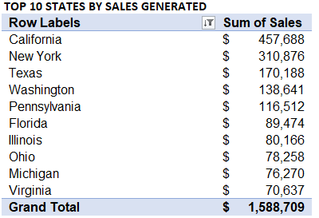

# US-SUPERSTORE
## Introduction
The report centers around a US Superstore, offering a comprehensive review of its sales performance over a four-year period **(2015-2018)**. Identifying the key drivers of growth and potential factors contributing to losses is essential for the store's continuous sales improvement and steady progress. Sales reporting plays a pivotal role in extracting valuable insights and assessing the efficacy of the strategies implemented in the store's operations. This dataset was chosen to analyze and gain insights into the various factors that impact the Superstore's ongoing success.
.

## Problem statement
The project intends to answer pertinent business questions that will share more light on the areas that US Superstore management will be interested in 
1.	Sales Performance Analysis
•	Sales trends across various months-This will be done with the use of a table and line chart.
•	Top and Bottom 10 sales-generating states- This will be done with the use of a column chart

3.	Profitability Performance Analysis
•	Profit trends across various months by states-This will be done with the use of a table and line chart.

5.	 Regional Analysis Review
•	Sales Performance by region review
•	Demand by region- region with high and low demand

7.	Means of shipment preferred by customers
   
9.	Category review
•	Best performing Category by sales
•	Best performing Sub-category
10.Top 10 cities by Demand/Purchase
    
	
# Skill/Concepts Demonstrated
1.	Data Management
2.	Data Manipulation
3.	Data Cleaning
4.	Pivot table
5.	Pivot chart- Visualization
6.	Conditional formatting
7.	Project documentation
   
# Dataset
Give a brief overview of the dataset you’re working on 

## Data Cleaning 

## Business Solutions and Insights Generated
The application of pivot tables and charts served as a useful means of manipulating data to derive meaningful insights that addressed the Business problems that are critical to the management thereby giving clarity and solutions to them. The following business problems were addressed:
1.	#Sales Performance Analysis
It is pertinent to analyze how the store performed across various months in other to detect peak and off periods, Months to engage in promotions. I focused on deriving sales trends across months, the top and bottom 10 sales-generating states
The steps applied are:

# Sales trends across various months
•	Dropped the month column in the row field and the sales column in the values field
•	Applied conditional formatting in other to see at a glance sales of high importance

 .
 
•	Used a Pivot chart to clearly visualize the trend with a line chart.

# Insight derived

.

In terms of sales, November achieved the highest sales of **$352,461**, closely followed by December’s **$325,294**, whereas February saw the lowest performance recording a sales figure of **$59,751**. From April to July, sales remained consistent, but there was an improvement starting in August. However, there was a slight decline in sales during October.

# Top and Bottom 10 sales-generating states

Relying solely on monthly sales performance is insufficient to gauge the financial strength of the store. To achieve our objective, it is essential to analyze sales by location. Therefore, I examined the top and bottom 10 sales-generating states:

.

# Insight derived

.
**California** stands out as the top state in generating the highest sales, closely followed by **New York**. In contrast, Virginia ranks lowest among the top 10 states in terms of sales. To address the considerable gap between the top two states, it is essential to prioritize efforts on enhancing sales in Texas, Washington, Pennsylvania, and Florida. By concentrating on these states, we can aim for a more equitable distribution of sales across our targeted regions.

